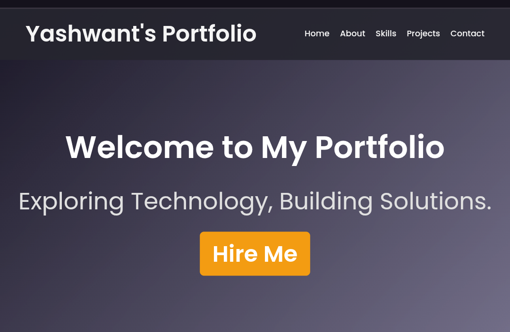

  

# Hey there! I'm Yashwant Mukati 👋

  

## 🎯 About Me

> **Aspiring Software Engineer | Database Engineer | Cybersecurity Expert **B.Tech Computer Science & Engineering** student at **Shivajirao Kadam Institute of Technology and Management, Indore** with a deep interest in **Machine Learning** and **Database Systems**[2]. Currently enhancing operational efficiency through hands-on experience and seeking opportunities to make a real impact in the tech industry[2][4].

[image:1]

- 🔭 I'm currently working on **Web Applications**
- 🌱 I'm currently learning **Web Development** and advancing my **Python** skills
- 🤖 I'm passionate about **Machine Learning** and **Database Management**
- 💡 Interested in **Cybersecurity** and **Augmented Reality** applications
- 📫 How to reach me: **yashwantid9981@gmail.com**
- 🎓 **CGPA**: 7.02/10 | **Graduation**: 2025
- 🌍 **Location**: Indore, India

## 💼 Professional Experience

### 🏢 Trainee Technical Manager | Magpie Engineering Pvt. Ltd.
**November 2024**[2]
- Streamlined coordination with banks for valuation requests and efficiently managed site data entry into databases
- Facilitated field operations by coordinating officer visits and collecting raw data
- Leveraged Microsoft Excel to track data records and generate detailed workflow reports, enhancing reporting accuracy

[image:2]

## 🚀 Featured Projects

### 🧾 **FairShare – Expense Splitting App**
**Tech Stack**: React.js, Node.js, Express, MongoDB[2]
- Developed a comprehensive bill-splitting web application with modular API-driven architecture
- Implemented seamless expense management with user-friendly interface
- Integrated robust testing including unit and integration tests

### 🥽 **Augmented Reality Map (Minor Project)**
**Tech Stack**: ARcore, Unity Engine, C#[2]
- Developed an indoor navigation tool using Augmented Reality to enhance accessibility within large organizations
- Created mixed reality (AR+VR) solution for complex building navigation[4]

### 📊 **Data Analysis Project**
**Tech Stack**: Python, SQL, MySQL[2]
- Solved real-world database challenges and analyzed large datasets
- Extracted meaningful insights using advanced SQL queries and data visualization

### 🌐 **Portfolio Website**
**Tech Stack**: HTML, CSS, JavaScript
- Created a responsive personal portfolio showcasing projects and skills
- Deployed on Netlify with modern design principles[4]

[image:3]

## 💻 Technical Skills

### Programming Languages

### Web Technologies

### Databases & Tools

### Development Tools

## 🎓 Education & Certifications

**🏫 Bachelor of Technology in Computer Science and Engineering**  
*Shivajirao Kadam Institute of Technology and Management, Indore (2021-2025)*[2]  
**CGPA**: 7.02/10

### 📜 Certifications
- **Live Database Training** - Geeks of Gurukul, Indore (Swiggy Database Queries)[2]
- **Python Training** - IIT Bombay[2]
- **Introduction to MySQL** - Infosys Springboard[2]

## 🏆 Leadership & Achievements

- 🎯 **Coordinator** - Tech Fest Technovation2K23, SKITM Indore[2]
- 📈 **Enhanced Reporting Accuracy** through workflow optimization at Magpie Engineering
- 🔍 **Problem Solver** with expertise in database management and real-world applications

## 🌟 Core Competencies

**🔧 Technical Expertise**[2][4]
- Database Management & Optimization
- Web Development (Full-Stack)
- Machine Learning & Data Analytics
- Augmented Reality Development
- Cybersecurity Fundamentals

**💼 Professional Skills**[2]
- Workflow Management & Process Optimization
- Team Coordination & Leadership
- Time Management & Adaptability
- Detail-Oriented Problem Solving

## 🎵 Beyond Coding

When I'm not coding, you can find me:
- 🎵 **Listening to Music** - My creative fuel
- ✈️ **Travelling** - Exploring new places and cultures[2]
- 📚 **Learning** - Always staying updated with latest tech trends
- 🤝 **Networking** - Connecting with industry professionals

## 📬 Let's Connect!

I'm always excited to collaborate on innovative projects and connect with fellow tech enthusiasts!

**"Exploring Technology, Building Solutions"**

---

  
  
  *⭐ Star my repositories if you find them useful!*

